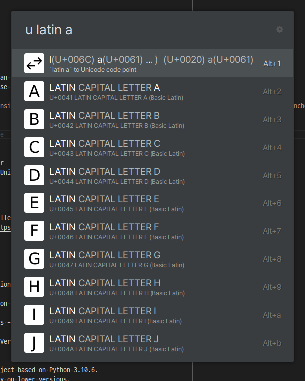

# Ulauncher - Unicode Extension

Unicode Extension for Ulauncher.

- **Ulauncher**: [Ulauncher — Application launcher for Linux 🐧](https://ulauncher.io/)
- **Unicode**: [Unicode – The World Standard for Text and Emoji](https://home.unicode.org/) ([Wikipedia - Unicode](https://en.wikipedia.org/wiki/Unicode))

This is personal project.

## How to use

> **Note**
>
> If you are looking for an extension to search for and type emojis,
> i highly recommend to use Emoji Extension.
>
> [Emoji — Ulauncher Extensions](https://ext.ulauncher.io/-/github-ulauncher-ulauncher-emoji) ([GitHub - Ulauncher/ulauncher-emoji: Emoji Extension](https://github.com/Ulauncher/ulauncher-emoji))

<!-- **TODO: Demo Gif** -->



Supported Features:

- Search Unicode character
- Convert letter to Unicode info

## How to Install

1. Ulauncher should installed
2. Install [RapidFuzz](https://github.com/maxbachmann/RapidFuzz)

   ```bash
   pip install rapidfuzz
   ```

3. Install Unicode Extension(this) on Ulauncher

   How to install Extension on Ulauncher: [About — Ulauncher Extensions](https://ext.ulauncher.io/about)

   > Ulauncher Preferences - Extensions - Add extension

Detail about version requirements:

- Ulauncher: 5.15.0
- Python: This extension has been tested with Python 3.10.6.
  It may not work properly on lower versions.

## Troubleshooting

- Unicode character icons do not shown properly:

  The icon for a character depends on the fonts installed on your device
  and the 'Unicode Character Icon Font' preference.

  Ensure that you have the appropriate preference or font installed that is
  capable of displaying the character.

- 'Unicode Character Icon Font' preference changes not affected immediately:

  This preference changes will not take effect properly
  until Ulauncher is restarted.

## License

> Unicode is a registered trademark of Unicode, Inc. in the United States
> and other countries. This application is not in any way associated with
> or endorsed or sponsored by Unicode, Inc. (aka The Unicode Consortium).

```text
Copyright (C) 2022 yeoneer

This program is free software: you can redistribute it and/or modify
it under the terms of the GNU General Public License as published by
the Free Software Foundation, either version 3 of the License, or
(at your option) any later version.

This program is distributed in the hope that it will be useful,
but WITHOUT ANY WARRANTY; without even the implied warranty of
MERCHANTABILITY or FITNESS FOR A PARTICULAR PURPOSE. See the
GNU General Public License for more details.

You should have received a copy of the GNU General Public License
along with this program. If not, see <http://www.gnu.org/licenses/>.
```

See also Full GNU GPL v3.0: [LICENSE](./LICENSE)
