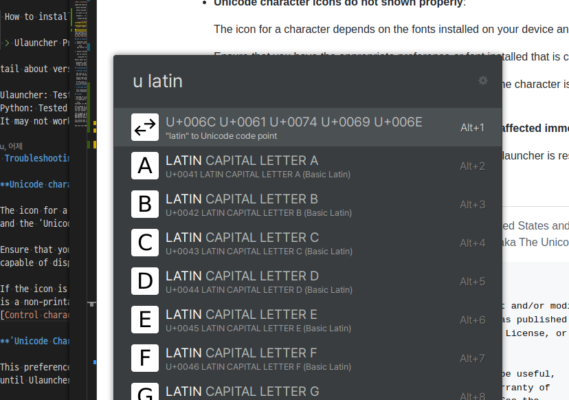

# Ulauncher - Unicode Extension

Unicode Extension for Ulauncher.

- **Ulauncher**: [Ulauncher — Application launcher for Linux](https://ulauncher.io/)
- **Unicode**: [Unicode – The World Standard for Text and Emoji](https://home.unicode.org/)
  ([Unicode - Wikipedia](https://en.wikipedia.org/wiki/Unicode))

> **Note**
>
> This extension supports **149,251 characters of the latest Unicode 15.0.0.**  
> (149,186 characters of Unicode Standard, 65 control characters)
>
> See also: [Unicode Character Count V15.0](https://www.unicode.org/versions/stats/charcountv15_0.html)



This is personal project.

## How to use

> **Note**
>
> If you are looking for an extension to search for and type emojis,
> i highly recommend to use Emoji Extension of Ulauncher.
>
> [Emoji — Ulauncher Extensions](https://ext.ulauncher.io/-/github-ulauncher-ulauncher-emoji)
> ([GitHub - Ulauncher/ulauncher-emoji: Emoji Extension](https://github.com/Ulauncher/ulauncher-emoji))

`u` in front of query(input) is keyword of this extension to run in Ulauncher.

### Search Unicode character

Search Unicode character by Unicode Code Point, Character Name.

If select item in search result, the character is copied into clipboard.

#### Search Example: U+2014 EM DASH

1. Input example: `u em dash`, `u 2014`, `u u+2014`
2. Find 'EM DASH' in search result and select
3. `—` is in clipboard. (Ctrl + V to paste)

About 'Em Dash(—)':

- [Dash - Em dash - Wikipedia](https://en.wikipedia.org/wiki/Dash#Em_dash)

#### Search Example: U+00C1 LATIN CAPITAL LETTER A WITH ACUTE

1. Input example: `u a with acute`, `u u+00c1`
2. Find 'LATIN CAPITAL LETTER A WITH ACUTE'
3. `Á`

About 'Latin Capital Letter A with Acute(Á)':

- [Á - Wikipedia](https://en.wikipedia.org/wiki/%C3%81)
- [Diacritic - Wikipedia](https://en.wikipedia.org/wiki/Diacritic)

#### Search Example: U+FF1F FULLWIDTH QUESTION MARK

1. Input example: `u fullwidth question`
2. Find 'FULLWIDTH QUESTION MARK'
3. `？`

About 'Fullwidth Question Mark(？)':

- [Question mark - Fullwidth question mark in East Asian languages - Wikipedia](https://en.wikipedia.org/wiki/Question_mark#Fullwidth_question_mark_in_East_Asian_languages)
- [Halfwidth and fullwidth forms - Wikipedia](https://en.wikipedia.org/wiki/Halfwidth_and_fullwidth_forms)

### Convert letter to Unicode info

Convert letter to Unicode info.

If select item in search result, the converted info is copied into clipboard.

#### Convert Example: One letter

Input example: `u 🐧`

```text
U+1F427 PENGUIN
```

#### Convert Example: Multiple Letter

Input example: `u Ulauncher — Application launcher for Linux 🐧` (title of <https://ulauncher.io>)

```text
U(U+0055) l(U+006C) a(U+0061) u(U+0075) n(U+006E) c(U+0063) h(U+0068) e(U+0065) r(U+0072)  (U+0020) —(U+2014)  (U+0020) A(U+0041) p(U+0070) p(U+0070) l(U+006C) i(U+0069) c(U+0063) a(U+0061) t(U+0074) i(U+0069) o(U+006F) n(U+006E)  (U+0020) l(U+006C) a(U+0061) u(U+0075) n(U+006E) c(U+0063) h(U+0068) e(U+0065) r(U+0072)  (U+0020) f(U+0066) o(U+006F) r(U+0072)  (U+0020) L(U+004C) i(U+0069) n(U+006E) u(U+0075) x(U+0078)  (U+0020) 🐧(U+1F427)
```

## How to install

1. Ulauncher should installed
2. Install [RapidFuzz](https://github.com/maxbachmann/RapidFuzz)

   ```bash
   pip install rapidfuzz
   ```

3. Install Unicode Extension(this) on Ulauncher

   How to install Extension on Ulauncher: [About — Ulauncher Extensions](https://ext.ulauncher.io/about)

   > Ulauncher Preferences - Extensions - Add extension - Enter `https://github.com/yeoneer/ulauncher-unicode`

Detail about version requirements:

- Ulauncher: Tested with Ulauncher 5.15.0 (latest release)
- Python: Tested with Python 3.10.6(latest on Ubuntu 22.04).
  It may not work on lower versions.

## Troubleshooting

- **Unicode character icons do not shown properly**:

  The icon for a character depends on the fonts installed on your device
  and the 'Unicode Character Icon Font' preference.

  Ensure that you have the appropriate preference or font installed that is
  capable of displaying the character.

  If the icon is Block Icon(🛇, Prohibited Icon), it means that the character
  is a non-printable character. In Unicode, it's a Control Character.
  [Control character - Wikipedia](https://en.wikipedia.org/wiki/Control_character)

- **'Unicode Character Icon Font' preference changes not affected immediately**:

  This preference changes will not take effect properly
  until Ulauncher is restarted.

## License

> Unicode is a registered trademark of Unicode, Inc. in the United States
> and other countries. This application is not in any way associated with
> or endorsed or sponsored by Unicode, Inc. (aka The Unicode Consortium).

```text
Copyright (C) 2022 yeoneer

This program is free software: you can redistribute it and/or modify
it under the terms of the GNU General Public License as published by
the Free Software Foundation, either version 3 of the License, or
(at your option) any later version.

This program is distributed in the hope that it will be useful,
but WITHOUT ANY WARRANTY; without even the implied warranty of
MERCHANTABILITY or FITNESS FOR A PARTICULAR PURPOSE. See the
GNU General Public License for more details.

You should have received a copy of the GNU General Public License
along with this program. If not, see <http://www.gnu.org/licenses/>.
```

See also Full GNU GPL v3.0: [LICENSE](./LICENSE)

---

The [Material Symbols and Icons - Google Fonts](https://fonts.google.com/icons)
([Apache-2.0 license](https://www.apache.org/licenses/LICENSE-2.0.html))
used in this project.

- `images/convert-icon.png`: [Material Symbols and Icons - Swap Horiz](https://fonts.google.com/icons?selected=Material+Symbols+Outlined:swap_horiz)
- `images/non-printable-icon.png`: [Material Symbols and Icons - Block](https://fonts.google.com/icons?selected=Material+Symbols+Outlined:block)
